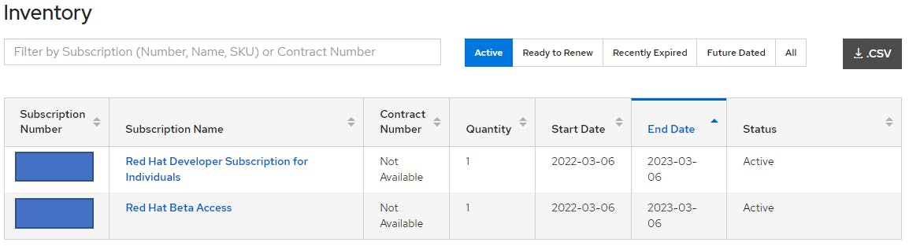


這篇文章來自於2022年5月，我發佈在HashNode平台的一篇同名文章 。因為沒有經營Hashnode，所以乾脆直接拉回來放一起管理。


ref: RHEL8.5安裝Docker小筆記[^1]

# 1. 環境說明
實驗主機的環境是Windows 11，所以需要使用到VirtualBox這個虛擬化解決方案 ，來達成我的目的。手邊如果沒有RHEL作業系統映像檔，可以自行前往Redhat Developer[^3]下載DVD iso檔來安裝。

* VirtualBox: 6.1.30
* RHEL: 8.5

# 2. 安裝Docker

## 2.1 設置Yum Repository

原先我是採用yum.repo去指向掛載的dvd.iso，用這個方式來安裝Yum Repository管理套件。但是發現DVD抓不到yum-utils這個套件，並且出現下面錯誤。

```bash
sudo yum install -y yum-utils
#Updating Subscription Management repositories.
#DVD for RHEL8 BaseOs                                                                                                                                        0.0  B/s |   0  B     00:00
#Errors during downloading metadata for repository 'DVD-BaseOS':
#  - Curl error (37): Couldn't read a file:// file for file:///mnt/dvd/BaseOS/repodata/repomd.xml [Couldn't open file /mnt/dvd/BaseOS/repodata/repomd.xml]
#Error: Failed to download metadata for repo 'DVD-BaseOS': Cannot download repomd.xml: Cannot download repodata/repomd.xml: All mirrors were tried
```

找了好久，真的很不熟RHEL的生態...所以決定找時間再研究這個議題。為了解決上述這個問題的方式，可以透過下面3個步驟來解決:


前提是機器的網路可以對外連線，若無法對外連線則需要透過其它方式。


### 註冊RedHat Developer帳號

查詢的過程中，發現其實RedHat有提供No-cost RHEL for developers subscription[^4]，所以我立馬去註冊一組帳號來試試。下圖是我菜味十足的訂閱資訊:



### 啟用機器的RHEL訂閱
至於啟用機器訂閱的方式則可以透過Registration Assistant[^5]這個服務，產生出對應的指令。本次我使用到下面這串指令完成了我的訂閱:

```bash
subscription-manager register --username <username> --password <password>
subscription-manager list
```

### 重新下載yum-utils

再次執行一開始的指令Complete!!!終於順利完成下載了!

```bash
sudo yum install -y yum-utils
sudo yum list --installed |grep -i yum-utils
#yum-utils.noarch             4.0.21-4.el8_5              @rhel-8-for-x86_64-baseos-rpms
```

解決註冊問題後，我們可以繼續配置安裝Docker套件所需要的設定:

```bash
sudo yum-config-manager \
--add-repo \
https://download.docker.com/linux/rhel/docker-ce.repo
sudo yum repolist
#Updating Subscription Management repositories.
#repo id                                                                           repo name
#docker-ce-stable                                                                  Docker CE Stable - x86_64
#rhel-8-for-x86_64-appstream-rpms                                                  Red Hat Enterprise #Linux 8 for x86_64 - AppStream (RPMs)
#rhel-8-for-x86_64-baseos-rpms                                                     Red Hat Enterprise #Linux 8 for x86_64 - BaseOS (RPMs)
```


這裡可以透過--enable去開啟特殊版本(nightly、test)的套件，但這邊可以先不需要理會。


## 2.2 安裝Docker套件

設置好repo可以開始進入主題，下載docker....等等，若是不指定版本基本上都會是下載latest版本的套件，不過個人習慣先確認好版本，所以會執行下列指令:

```bash
yum list docker-ce --showduplicates | sort -r
#Errors during downloading metadata for repository 'docker-ce-stable':
#  - Status code: 404 for https://download.docker.com/linux/rhel/8/x86_64/stable/repodata/repomd.xml (IP: 13.35.166.118)
#Error: Failed to download metadata for repo 'docker-ce-stable': Cannot download repomd.xml: Cannot download repodata/repomd.xml: All mirrors were tried
#Updating Subscription Management repositories.
#Docker CE Stable - x86_64                       337  B/s | 381  B     00:01
```

你沒看錯，又遇到問題了。檢查一下官網文件[^2]後發現原來是自己眼拙，其實最開始的Note就有提到:

>We currently only provide packages for RHEL on s390x (IBM Z). Other architectures are not yet supported for RHEL, but you may be able to install the CentOS packages on RHEL. Refer to the Install Docker Engine on CentOS page for details.
>
>from "Install Docker Engine on RHEL 2022.03.06"

所以2.1 設置Yum Repository中，配置安裝Docker套件所需要的設定，只要從指向RHEL Repository改為從CentOS Repository拉取套件就可以:

```bash
sudo yum-config-manager \
--add-repo \
https://download.docker.com/linux/centos/docker-ce.repo

yum list docker-ce --showduplicates | sort -r
#Updating Subscription Management repositories.
#docker-ce.x86_64                3:20.10.9-3.el8                 docker-ce-stable
#       ...                          ...                              ...
#Docker CE Stable - x86_64                        56 kB/s |  20 kB     00:00
#Available Packages
```

確認好版本後，安裝Docker我們需要3個套件: docker-ce、docker-ce-cli、containerd.io，這次也是十分爭氣的遇到錯誤(很長一串所以我刪掉...一些):

```bash
sudo yum install -y docker-ce-3:20.10.9-3.el8 \
docker-ce-cli-1:20.10.9-3.el8 \
containerd.io
#Updating Subscription Management repositories.
#Last metadata expiration check: 0:41:05 ago on Sun 06 Mar 2022 09:19:20 PM CST.
#Error:
# Problem 1: problem with installed package podman-1:3.4.2-9.module+el8.5.0+13852+150547f7.x86_64
# Problem 2: problem with installed package podman-catatonit-1:3.4.2-9.module+el8.5.0+13852+150547f7.x86_64
```

原來我又粗心了，以為新的作業系統就不會有套件衝突問題，原來RHEL8.5預設會安裝podman、runc，套件間會產生衝突。所以這次為了保守起見，我全部移除後再重新安裝，這次終於沒有怪怪的訊息了:

```bash
# 移除套件
sudo yum remove docker \
docker-client \
docker-client-latest \
docker-common \
docker-latest \
docker-latest-logrotate \
docker-logrotate \
docker-engine \
podman \
runc
```

再次安裝理論上會順利出現久違的Complete!!!

```bash
sudo yum install -y docker-ce-3:20.10.9-3.el8 \
docker-ce-cli-1:20.10.9-3.el8 \
containerd.io
```

## 2.3 啟動Docker Engine

這次十分順利的啟動Docker:

```bash
sudo systemctl start docker
sudo systemctl enable docker
```

如果想再確認一下是否成功，可以檢查systemd是否正常運作:

```bash
systemctl status docker
#● docker.service - Docker Application Container Engine
 #  Loaded: loaded (/usr/lib/systemd/system/docker.service; enabled; vendor preset: disabled)
#   Active: active (running) since Mon 2022-03-07 13:23:51 CST; 1min 25s ago
#     Docs: https://docs.docker.com
# Main PID: 1183 (dockerd)
#    Tasks: 7
#   Memory: 131.4M
#   CGroup: /system.slice/docker.service
#           └─1183 /usr/bin/dockerd -H fd:// --containerd=/run/containerd/containerd.sock
```

# 3. 測試Docker基本功能

我們可以嘗試做一些docker指令來驗證docker服務是否正常。不過，本篇主要是紀錄如何安裝Docker，所以接下來並不會做過多的說明:

## 3.1 檢查Docker版本

這裡顯示的Docker版本資訊，會根據安裝的版本不同而有所差異。

```bash
docker --version
# Docker version 20.10.9, build c2ea9bc
```

## 3.2 執行Docker容器

我們可以找個簡單的image來執行。特別提到Docker在本地沒有找到符合名字的image時，則會去Docker Hub抓對應的image下來。所以，如果RHEL8.5沒有對外網路連線，出現錯誤訊息是正常的歐~

```bash
docker run -p 80:80 -d nginx
#Unable to find image 'nginx:latest' locally
#latest: Pulling from library/nginx
#f7a1c6dad281: Pull complete
#4d3e1d15534c: Pull complete
#9ebb164bd1d8: Pull complete
#59baa8b00c3c: Pull complete
#a41ae70ab6b4: Pull complete
#e3908122b958: Pull complete
#Digest: #sha256:1c13bc6de5dfca749c377974146ac05256791ca2fe1979fc8e8278bf0121d285
#Status: Downloaded newer image for nginx:latest
#b107a9214cbf0bfe53c2a97c56e28540858138d091efbc3ff9e4dcb8c3afc788
```

## 3.3 確認Docker執行的服務

我們執行的Container是Nginx，如果把Port轉發到本地則可以訪問預設的Nginx服務。

```bash
docker ps
#CONTAINER ID   IMAGE     COMMAND                  CREATED         STATUS         PORTS                               #NAMES
#b107a9214cbf   nginx     "/docker-entrypoint.…"   5 seconds ago   Up 4 seconds   0.0.0.0:80->80/tcp, :::80->80/tcp   priceless_curie
curl http://localhost:80
#<!DOCTYPE html>
#<html>
#<head>
#<title>Welcome to nginx!</title>
#<style>
#html { color-scheme: light dark; }
#body { width: 35em; margin: 0 auto;
#font-family: Tahoma, Verdana, Arial, sans-serif; }
#</style>
#</head>
#<body>
#<h1>Welcome to nginx!</h1>
#<p>If you see this page, the nginx web server is successfully installed and
#working. Further configuration is required.</p>

#<p>For online documentation and support please refer to
#<a href="http://nginx.org/">nginx.org</a>.<br/>
#Commercial support is available at
#<a href="http://nginx.com/">nginx.com</a>.</p>

#<p><em>Thank you for using nginx.</em></p>
#</body>
#</html>
```

# 4. 總結

RHEL8.5環境下，比起安裝Docker CE，Container操作更推薦直接使用Podman、Skopeo跟Buildah，因為DVD.iso已經有提供了(誤)。雖然兩者有些微的不同，不過大致上都是符合OCI(Open Container Initiative)[^6]標準。整篇實作下來，Docker官網文件[^2]寫得蠻清楚，步驟的安排也有考量到許多細節，值得所有會接觸到Docker的朋友看一看。

幸好我比較粗心，所以這篇的篇幅才能拉這麼長😂除了碩士論文以外，第一次寫這麼長的文章，如果有任何建議，歡迎各位朋友不吝指教。當然有新手疑問也可以直接來詢問，我十分希望可以藉由這種互動的方式，優化、補強自己不足的地方。感謝各位看倌的收看~下次見🖐

# 5. 參考資料

[^1]: [RHEL8.5安裝Docker小筆記](https://codingfrank.hashnode.dev/dockeronrhel85fornew)
[^2]: [Install Docker Engine on RHEL](https://docs.docker.com/engine/install/rhel/)
[^3]: [Redhat Developer](https://developers.redhat.com/products/rhel/download)
[^4]: [No-cost RHEL for developers subscription](https://developers.redhat.com/products/rhel/download)
[^5]: [Registration Assistant](https://access.redhat.com/labs/registrationassistant/)
[^6]: [OCI(Open Container Initiative)](https://opencontainers.org/about/overview/)
