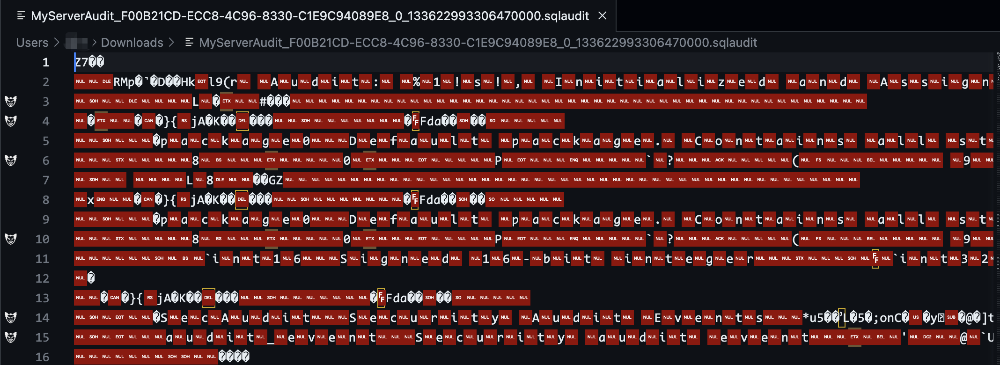
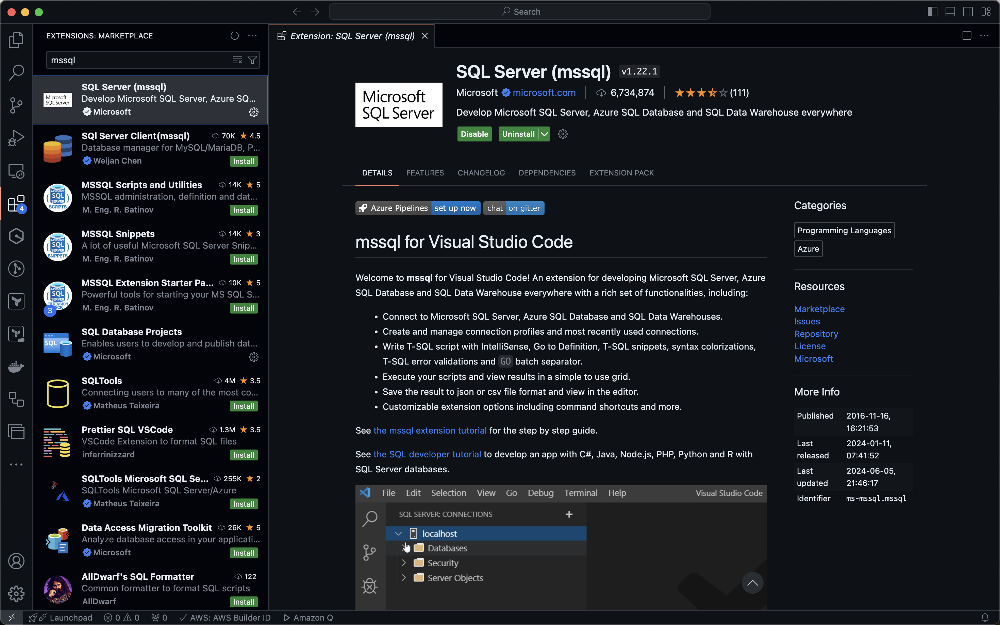
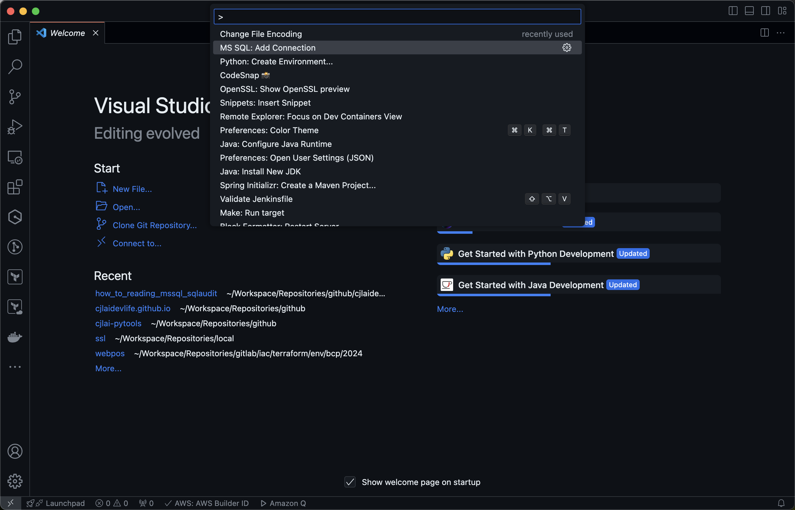
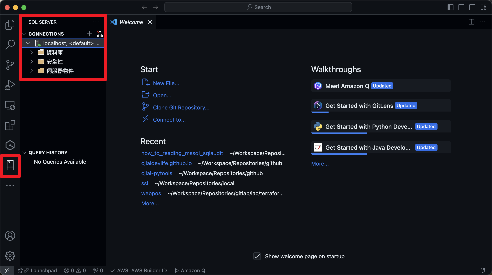
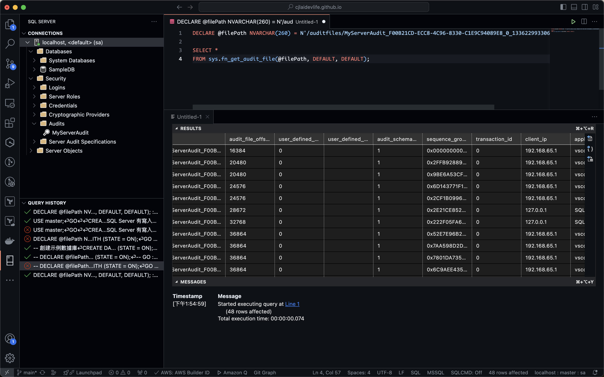
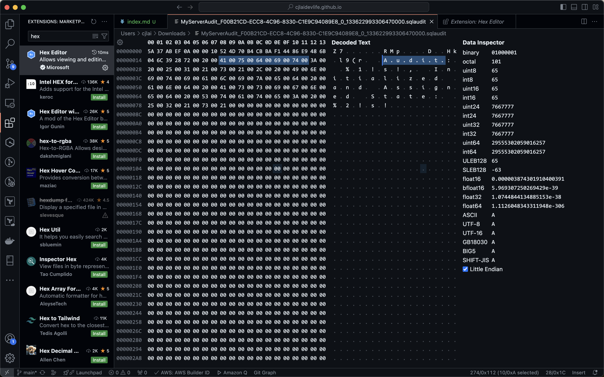

# 1. 背景

直接打開從MSSQL備份下來的`*.sqlaudit`檔案，會因為該檔案經過MSSQL編碼過，而出現無法直接識別的亂碼文件。



---

# 2. 前置條件

若要查看`*.sqlaudit`的內容，需要符合下列條件:

1. 查詢MSSQL的編輯器<br/>
   可以參考官方提供的工具[^1]，例如: SQL Server Management Studio、Azure Data Studio，或是透過vscode安裝mssql extension[^5]。

2. Microsoft SQL Server<br/>
   除了手邊既有的mssql，推薦可以透過docker建立一座臨時的mssql container。

---

# 3. 解決方式

## 3.1 低成本取得MSSQL {#3-1}


透過docker container的技術，我們可以減少取得測試用資料庫所需的成本。


首先將下面yaml格式的內容存成`docker-compose.yml`:

```yaml
# Version: "3.9"
services:
  db:
    image: mcr.microsoft.com/mssql/server:2019-latest
    platform: linux/amd64
    ports:
      - "1433:1433"
    volumes:
      - .:/auditfiles
    environment:
      ACCEPT_EULA: "Y"
      SA_PASSWORD: "Passw0rd"
```

* **version**: 內容會將他註解掉是因為，docker最新的官方文件已經將version這個element標示為obsolete[^2]，考量到有些沒有更新的docker compose的使用者而以註解的形式保留。
* **platform**: 這個設定並非必要，主要是我在執行時所使用的設備是arm cpu，所以需要指定platform[^3]。
* **environment**: 在Linux上可以設定的mssql環境變數可以參考官網文件[^4]。
* **volumes**: 會掛載當前路徑到container內，所以`*.sqlaudit`檔案也需要放在當前目錄下。

接下來只需要透過docker compose的指令就可以取得測試用資料庫:

```bash
docker compose up -d
```

---

## 3.2 透過VS Code連線到MSSQL


目前還是習慣在vs code執行各項作業，所以工具選型才會是透過vs code + extension的方式進行。如果手邊有SSMS或其他工具可以連線到MSSQL，那就可以忽略這個小節。


安裝僅需要打開vscode找到MSSQL的extension[^5]，按下install即可:



接下來可以嘗試連線到步驟[3.1 低成本取得MSSQL](#3-1)所建立的資料庫:


除了hostname是連線到localhost以外，剩下的設定都是依照步驟[3.1 低成本取得MSSQL](#3-1)，啟動資料庫時傳入的參數而定。




登入成功就可以得到如下圖紅匡標示的結果:



---

## 3.3 直接在VS Code上讀取sqlaudit檔


這邊要注意sqlaudit的檔案位置是我們透過docker volume的方式，將`*.sqlaudit`檔案所在路徑mount到mssql的container內。


```sql
DECLARE @filePath NVARCHAR(260) = N'/auditfiles/xxx.sqlaudit';

SELECT *
FROM sys.fn_get_audit_file(@filePath, DEFAULT, DEFAULT);
```

完成後查詢結果大約會像下圖所示:



---

## 4. 總結

撰寫這篇文章時，內心其實有點猶豫。雖然有ChatGPT可以輔助，但要將這次內容的知識點逐一點到說明真的很困難!這次使用的解決方法有需多前置的知識需要了解，例如: Docker Compose是什麼?VS Code怎麼用...等等。

寫到後面發現這篇文章的定位十分尷尬。對於新手來說，很容易被多個不同技術繞到頭暈目眩;對於老手來說，這篇文章解決的議題又太過沒有深度。所以這篇就當作是練練手，後續再持續找時間優化它吧。

最後有發現，其實也可以透Hex Editor[^6]之類的工具去確認編碼，然後再轉成可讀取的編碼就好，但是內容格式有點難讀就是了。這篇文章暫時就不追那麼深，希望未來有機會再去往下探索，感謝各位看官收看，希望有機會收到更多的回饋，謝謝。



[^1]: [連線到 SQL Server 資料庫引擎 - SQL Server | Microsoft Learn](https://learn.microsoft.com/zh-tw/sql/sql-server/connect-to-database-engine?view=sql-server-ver16)
[^2]: [Version top-level element (obsolete)](https://docs.docker.com/compose/compose-file/04-version-and-name/#version-top-level-element-obsolete)
[^3]: [Services top-level elements-platforms](https://docs.docker.com/compose/compose-file/05-services/?highlight=platforms#platform)
[^4]: [使用環境變數在 Linux 上設定 SQL Server 設定](https://learn.microsoft.com/zh-tw/sql/linux/sql-server-linux-configure-environment-variables?view=sql-server-ver16)
[^5]: [Visual Studio Market Place SQL Server (mssql)](https://marketplace.visualstudio.com/items?itemName=ms-mssql.mssql)
[^6]: [Visual Studio Market Place Hex Editor](https://marketplace.visualstudio.com/items?itemName=ms-vscode.hexeditor)
